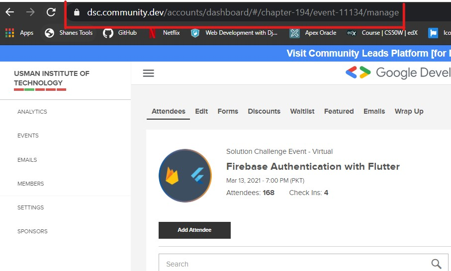

# Google DSC Platform Extension - Version 3.0
This Extension allows DSC Lead to add attendees from a .CSV file through automated process in any hosted session on DSC Platform.
## changes
### 1) Now you can add attendees by giving event link as an input It will add attendees to that particular event.


Find User Guide Below OR Find **Youtube** Tutorial at
https://www.youtube.com/watch?v=HOi1MoDM1Uk&feature=youtu.be

### Installation
1) **Install Python** from https://www.python.org/downloads/
2) **Install Dependencies**
Open cmd in folder DSC Platform Extension and run this command
```ruby
pip install -r requirements.txt
```
3) Run **DPE.sh** file by double clicking it
### You are ready to go!
The extension is developed by [Raheel Siddiqui](https://github.com/rawheel) with :heart:

## USER GUID (STEPS TO FOLLOW)
### 1) Save your data by giving particular information.

### 2) select .CSV which has attendees data, goto (help -> warnings) to check detailed constraints.

### 3) Paste the event link from event dashboard for example:

### 4) Click on Start button & see the magic. 😃

### Limitations
1) It is assumed that an account having extension other than gmail is being used. (e.g XXXX@student.uet.edu.pk)

