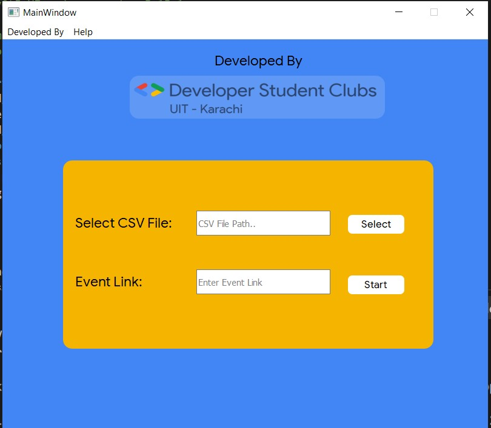

# DSC-Platform-Extension
Find **Youtube** Tutorial at
https://www.youtube.com/watch?v=HOi1MoDM1Uk&feature=youtu.be
### Installation
1) **Install Python** from https://www.python.org/downloads/
2) **Install Dependencies**
Open cmd in folder DSC Platform Extension and run this command
```ruby
pip install -r requirements.txt
```
3) Run **DPE.sh** file by double clicking it
### You are ready to go!
The extension is developed by [Raheel Siddiqui](https://github.com/rawheel) with :heart:

## Screenshots
 


### Limitations
1) It is assumed that an account having extension other than gmail is being used. (e.g XXXX@student.uet.edu.pk)
2) Only a person with Lead role is able to add the CSV file to event.
3) Try adding attendees in small batches (e.g. 50).
4) It only adds attendees to the top most event in any selected category.
